# **Taking a Picture and Privacy in Android**

## **Introduction**
(App and article based on Android 11)

Taking a picture is a basic functionnality provided by mobile devices today. There are two ways to achieve this end-user scenario: delegating the scenario by **opening the standard built-in camera app**, or by directly **controlling the camera**. An example of the former is the standard built-in app for texting that opens the camera app to send a picture. An example of the latter is an application like Snapchat that directly controls the camera which enables the customization of the user experience such as trying on filters during the process of taking a picture.

The article will first demonstrate how the app takes a picture, followed by a discussion on the relevant privacy requirements and threats, and how to support those requirements/mitigate the threats.

## **Code Demo**
### Opening the Camera
<p align="center">
  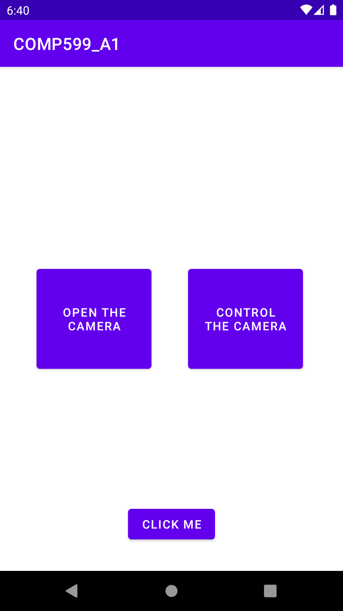
   
  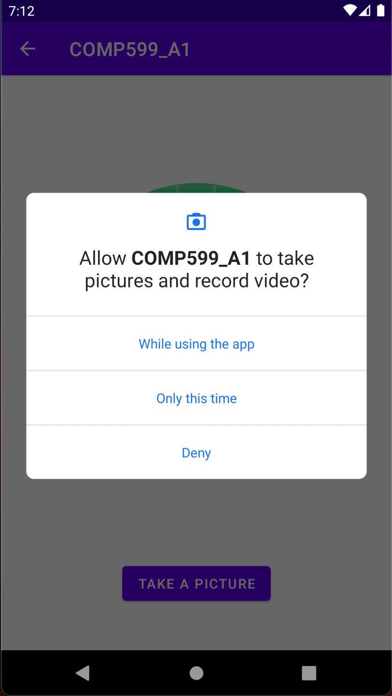 
   
   
  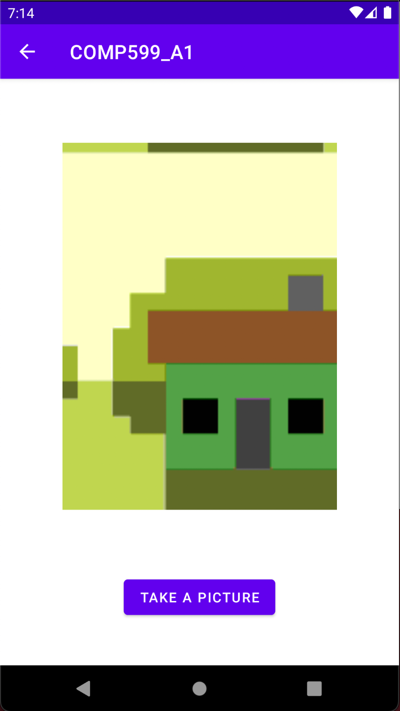 
</p>

1. The user clicks on the top left button to open the camera.
1. A new activity is launched.
1. The user clicks the bottom button and, if the permission to access the camera is not already granted, the user is asked for that permission.
1. If granted, the standard camera app opens.
1. The user can now take (and retake) a picture.
1. Once the picture is chosen, the user is brought back to the activity where the picture is displayed.

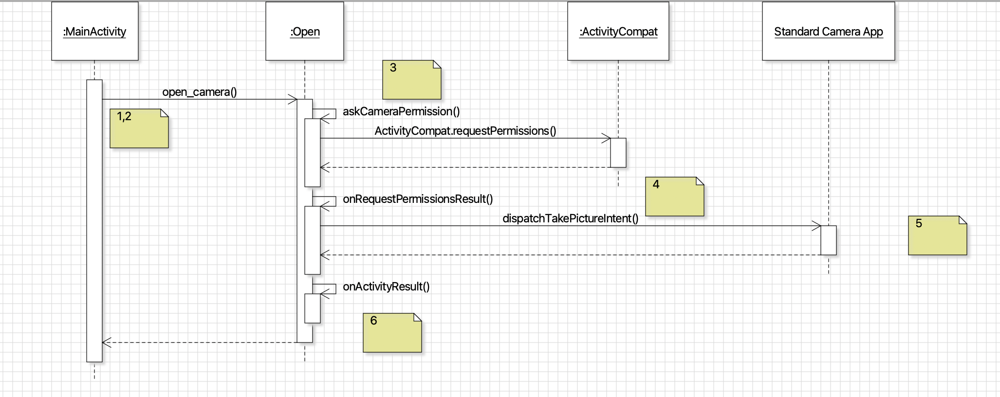

### Controlling the Camera
<p>
  
  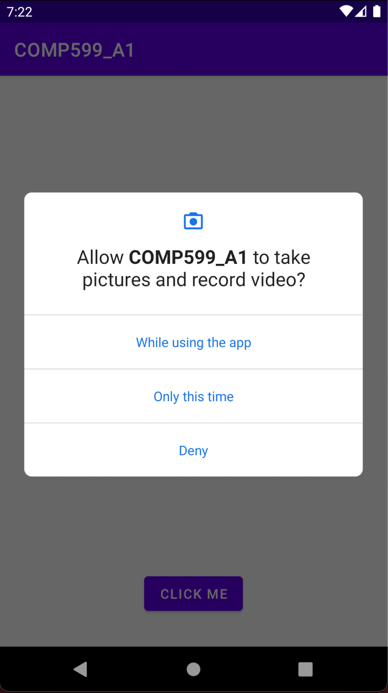 
  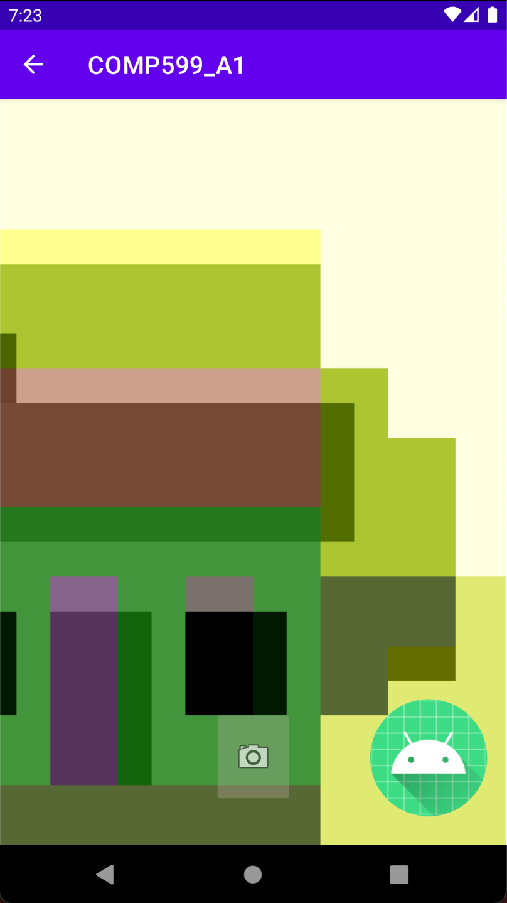 
  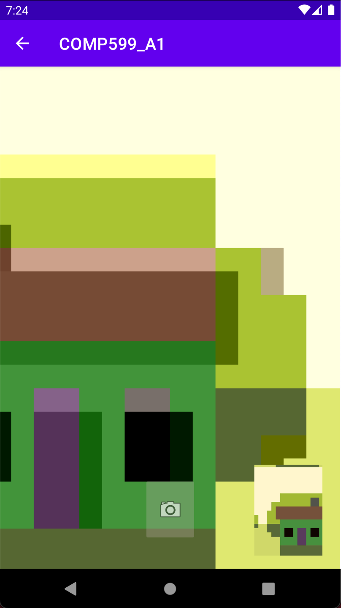 
</p>

1. The user clicks on the top right button to control the camera.
1. If the permission to access the camera is not already granted the user is asked for that permission.
1. If granted, a new activity starts where the user is able to control the camera.
1. The user can press the bottom button to take a picture and have it displayed in the bottom right corner of the screen.

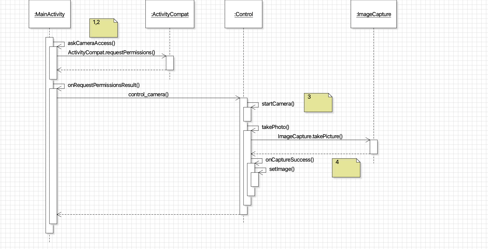
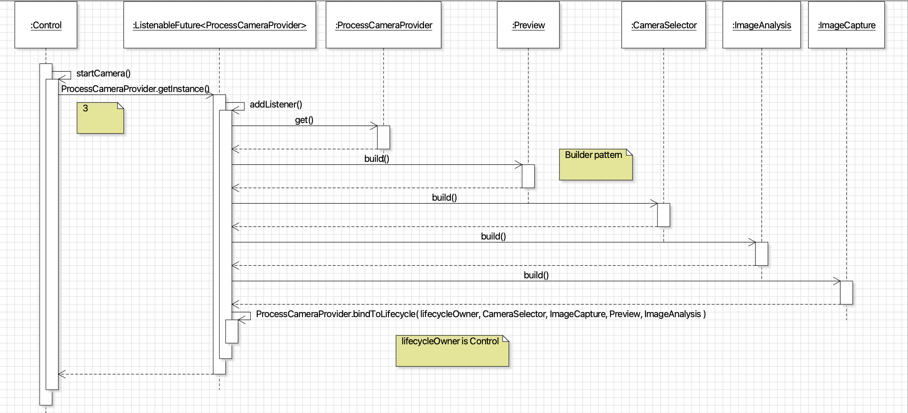

### Controlling the Camera and Hiding It
<p>
  
  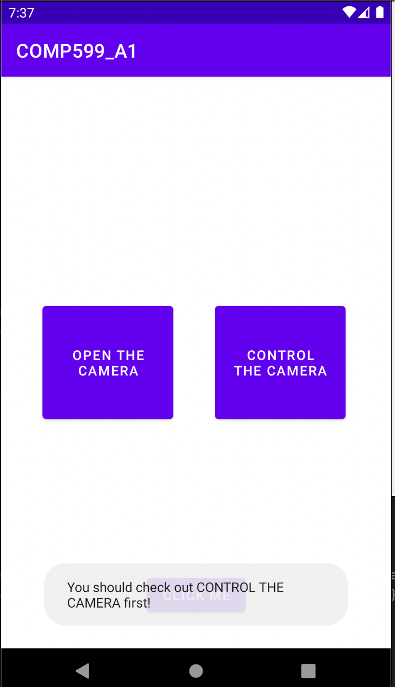  
  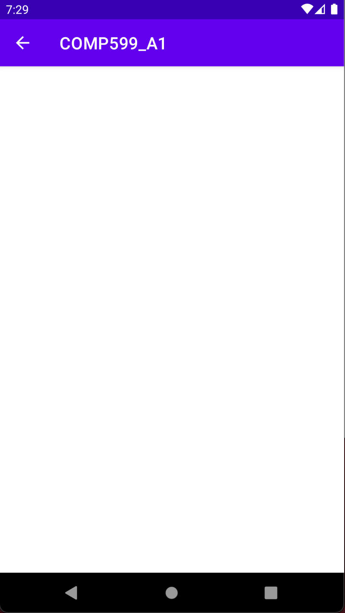
  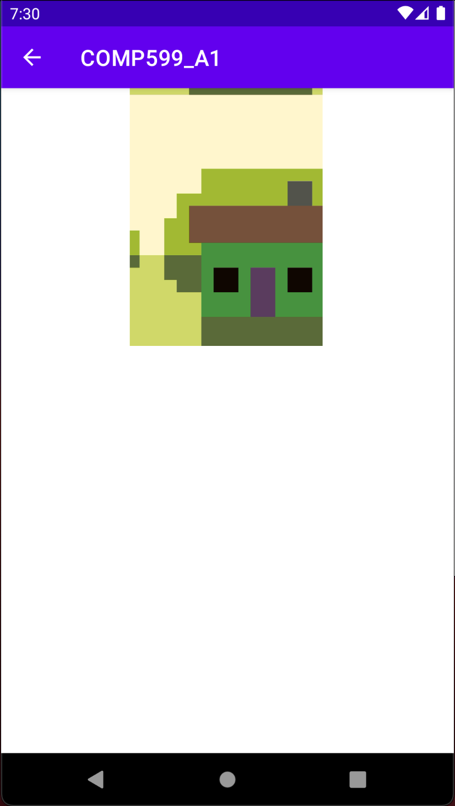 
</p>

1. The user clicks the bottom button.
1. If the permission to access the camera is not granted, the user is told to check the top right button instead (the previous scenario). If the user does achieve the previous scenario, then the app must have been granted permission to access the camera.
1. A new activity is started which seems to be blank. In reality, it is the same activity as the previous scenario but the screen showing what the camera is seeing is covered by other widgets or UI elements.
1. If the user clicks on the screen, an invisible button (here the button covers the bottom half of the screen and is the same color as the background) is pressed and a picture is taken. The picture is displayed for demonstration purposes.

## **Privacy Requirements and Threats**
Since a picture of an individual can be used to distinguish or trace that individual, it falls under the definition of **personally identifiable information** (PII) according to NIST SP 800-122 [1]. Furthermore, depending on the picture taken of the individual, the picture can be regarded as **sensitive PII**. The picture itself could also contain sensitive PII or confidential information such as passwords, social security number, etc.

The Organisation for Economic Co-operation and Development (OECD) lists principles that many standards, regulations, and organizational policies follow. The ideal app taking a picture would be in accordance with those following 8 principles [2]:
- **Collection limitation**: The collection of the pictures of the individual should be limited and only obtained with the consent and knowledge of the individual:
- **Data quality**: Taking a picture should be relevant to the purpose of the app.
- **Purpose specification**: The purposes for which the picture is taken or collected should be specified not later than at the time of data collection. Taking a picture should only be used to fullfill those purposes only.
- **Use limitation**: The picture taken should not be disclosed or made available except with the consent of the individual or by authority of law.
- **Security safeguards**: The picture taken should be protected by reasonable security safeguards.
- **Openness**: There should be a general policy of openness about developments, practices, and policies with respect to the picture taken.
- **Individual participation**: An indivudual should have the right to: obtain the picture taken collected by the app, receive confirmation that the app has pictures of them, and have the picture taken erased.
- **Accountability**: The app should be held accountable for complying with measures which give effect to the principles stated above.

### Permissions
In android, much of the privacy surrounding apps revolves around permissions. A developer can declare that an app needs access to a certain feature in the manifest file.
For example, 

`<uses-permission android:name="android.permission.CAMERA" \>` 

means that the application must request permission to use the device's camera. 
<p>
  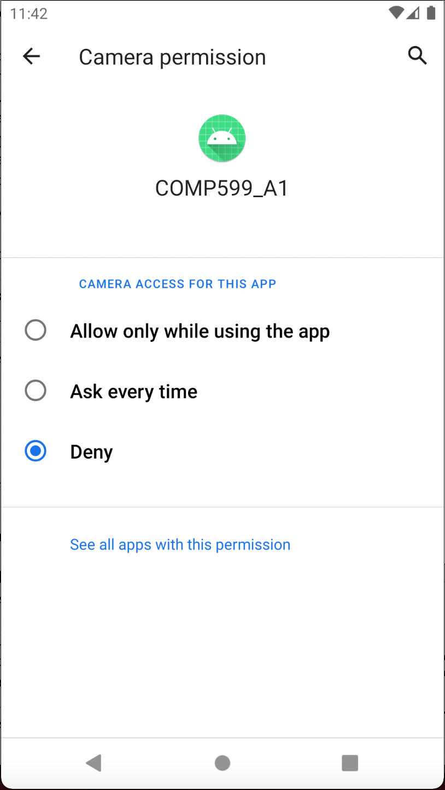
  <i>The declaration in the manifest allows the user to modify the permission access for the camera.</i>
</p>
However, depending on how the end-user scenario is implemented, the role of permissions vary.

### Opening the Camera
Users may be under the impression that not giving an app permission to use the camera means it cannot be accessed. This assumption is not correct as android makes the distinction between regular permissions and dangerous permissions. Invoking a camera app does not fall under the category of dangerous permission. As such, a developer could omit the declaration in the manifest file and directly invoke another camera app without requesting the user for permission.
This also means the user can no longer deny access to the camera.
<p>
  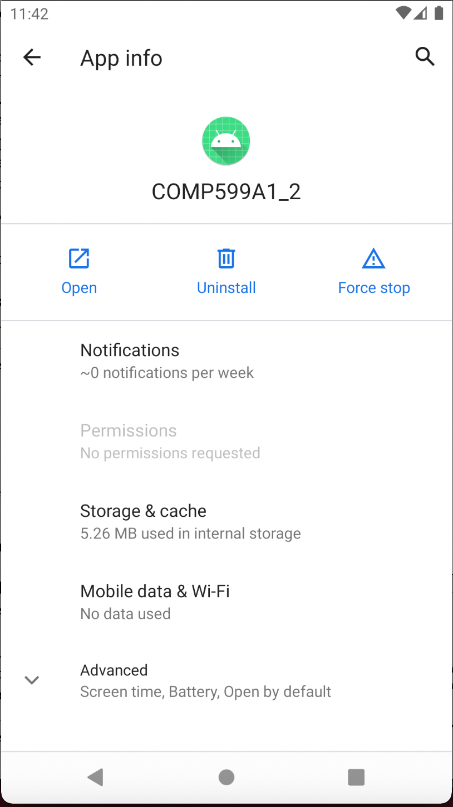
  <i>Omiting the declaration in the manifest disables the user from making any modification to the permission access for the camera.</i>
</p>

This relaxation in permission when invoking another camera app can lead to **second order permission re-delegation threat** [6]. It is possible to create an `Intent` with `IMAGE_CAPTURE` and `EXTRA_OUTPUT` to request the camera app to capture an image and specify an accessible location where it will be saved. In this manner, the malicious app can take a picture regardless of its own permission. A malicious app can send an `Intent` to a vulnerable app to request the picture and monitor the output to steal it [6].
<p>
  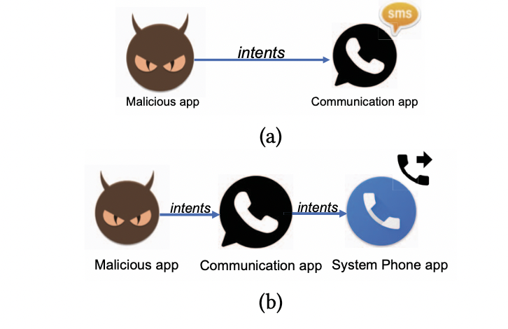
  <i>Analagous example of second order permission re-delegation with a communication app [6].</i>
</p>

### Controlling the Camera
As opposed to invoking a camera app, controlling the camera falls under the category of dangerous permission. Therefore, 

`<uses-permission android:name="android.permission.CAMERA" \>` 

must appear in the manifest file. 

The customization associated with controlling the camera comes at the cost of another threat: **camera use without user's knowledge**. The code demo shows one way to secretely use the camera by covering the activity with another UI element. Once an app is granted permission to access the camera, there are many possibilities to use the camera both in app and in the background while using the customization that comes with controlling the camera to hide its use to the user. This effective spying can capture any information in the field of vision of the camera such as using the front facing camera to analyze the user's face and eye movements [3]. 

86% of malware are repackaged versions of legitimate apps in order to first obtain the camera permission from the user [4]. For example, a user would enable a QR-code scanner app to access the camera. Using the permission,the malicious app could potentially take pictures [4].

However, when a camera driver is globally accessible, the malicious app is able to directly access it without needing permission [4]. To understand why, here is how controlling the camera normally works:
1. The app sends a request to the mediaserver process where the Camera Service runs via Binder Inter-process Communication (IPC).
1. The mediaserver process sends a request to the systemserver process via the camera API.
1. The code that takes the picture in the Camera Service run is inside the mediaserver process in a shared object library.
1. The camera driver could be directly accessed by that library without the app having any Binder IPC.

<p>
  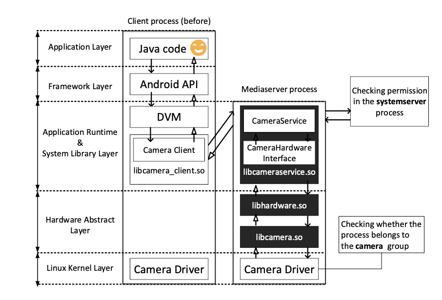
  <i>The workflow of the Camera Service [4].</i>
</p>

A malicious app could transplant the shared object libraries from the mediaserver to its own process, directly accessing the camera driver to take pictures. This is known as a **transplantation attack** [4]. If the camera driver is not globally accessible, the app will need the permission to access the camera before making a transplantation attack.


Depending on what information is captured, this threat could lead to the following problematic data actions [7]: appropriation, distortion, surveillance, or unanticipated revelation. These problematic data actions could in turn lead to the following privacy harms [7]: loss of self-determination and discrimination (through blackmail for example), loss of trust, and economic loss.

## **Privacy Controls**
As done in the code demo, including 

 `<uses-permission android:name="android.permission.CAMERA" \>`
 
in the manifest file to require the user's permission to access the camera is an example of **best practices** for user's consent and knowledge. This should be done even if it is unnecessary in the case of opening the camera.

Before accessing the camera, we check whether the permission is granted. If not, we ask the user for permission.
```   
if (ContextCompat.checkSelfPermission(this, Manifest.permission.CAMERA) != PackageManager.PERMISSION_GRANTED) {
            ActivityCompat.requestPermissions(this, new String[]{Manifest.permission.CAMERA}, REQUEST_CAMERA_PERMISSION);
        } else {
            // Permission already granted, can access the camera
        }
```
<p align="center">
   
  <i>The user is asked for permission to access the camera</i>
</p>
Once the user has responded, the app can proceed with the following: 

```
    @Override
    public void onRequestPermissionsResult(int requestCode, @NonNull String[] permissions, @NonNull int[] grantResults) {
        super.onRequestPermissionsResult(requestCode, permissions, grantResults);
        if (requestCode == REQUEST_CAMERA_PERMISSION) {
            if (grantResults.length > 0 && grantResults[0] == PackageManager.PERMISSION_GRANTED) {
                // Permission granted, can access the camera
            } else {
                // Indicate to the user that the permission was denied
            }
        }
    }
```
### Sensitive Information in Camera's Field of Vision
To avoid leaking sensitive information through the camera, one can apply the principle of **least priviledge** [5] where the application only has access to the minimum visual information needed for their functionnality. Once an app is granted permission to access the camera, the system can use computer vision to restrict non-essential objects from being viewed. This method requires recognizers to anticipate which objects the camera is allowed to see. Although this would provide strong security against leakage, it is unlikely to anticipate all classes of objects that future apps will want to see.

Another promising approach that would be more broadly effective is the use of **privacy markers** [5]. This method consists of using an interface to mark physical objects and software to recognize the marked objects. Using the principle of least priviledge, the app will only view the marked objects through the camera. 
### Camera Use Without User's Knowledge
**Camera Nudges** can be used to indicate to the user when the camera is being used. Examples of nudging approaches are notification nudges, frame nudges, and camera preview nudges [3].
<p align="center">
  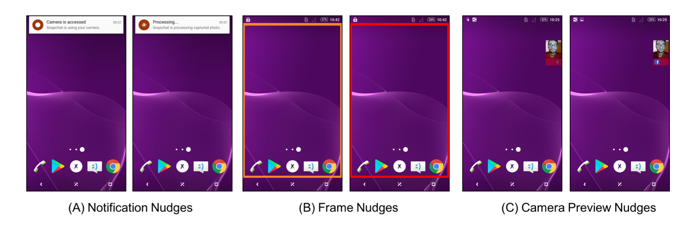 
</p>
The important part of this method is to not bully the user into security. Nudges that are seen as excessive or annoying may lead users to ignore future warnings [3]. One way to make nudges more user friendly is to allow them to customize their own. In this manner, the user will feel more comfortable with the nudges and will not be confused by their intent.

Another approach is **API auditing**, which records when and which API is called [4]. By going through the audit files, a user would then be able to identify malicious apps calling the Camera API to access the camera without the user's knowledge.  

Both camera nudges and API auditing would be implemented in relation to the Camera API being used. These methods would be ineffective against a translation attack whose whole purpose is to evade using the API. 

A translation attack works by directly accessing the camera driver of the device which requires the malicious app to be assigned with the camera group ID [4]. If the driver is not globally available, the malicious app can only be assigned to the camera group ID by asking the user for camera access. In this scenario, one way to defend against a translation attack would be to **break the binding between permissions and group IDs** [4]. Taking a picture would then require going through the mediaserver process in which the Camera Service runs (using the camera API) and the malicious app would no longer be able to directly access the camera driver, even with the permission to access the camera.   

## **References**
[1] NIST: National Institute of Standards and Technology. _Special Publication 800-122: Guide to Protecting the Confidentiality of Personally Identifiable Information (PII)_. April, 2010. https://nvlpubs.nist.gov/nistpubs/Legacy/SP/nistspecialpublication800-122.pdf

[2] OECD: The Organisation for Economic Co-operation and Development. _Guidelines on the Protection of Privacy and Transborder Flows of Personal Data_. 2013. http://www.oecd.org/digital/ieconomy/oecdguidelinesontheprotectionofprivacyandtransborderflowsofpersonaldata.htm

[3] Mariam Hassib, Hatem Abdelmoteleb, and Mohamed Khamis. November 2020. Are my Apps Peeking? Comparing Nudging Mechanisms to Raise Awareness of Access to Mobile Front-facing Camera. In _MUM 2020: 19th International Conference on Mobile and Ubiquitous Multimedia Pages 186–190_. https://doi-org.proxy3.library.mcgill.ca/10.1145/3428361.3428384

[4] Zhongwen Zhang, Peng Liu, Ji Xiang, Jiwu Jing, and Lingguang Lei. March 2015. How Your Phone Camera Can Be Used to Stealthily Spy on You: Transplantation Attacks against Android Camera Service. In _CODASPY '15: Proceedings of the 5th ACM Conference on Data and Application Security and Privacy Pages 99–110_. https://doi-org.proxy3.library.mcgill.ca/10.1145/2699026.2699103

[5] Nisarg Raval, Animesh Srivastava, Ali Razeen, Kiron Lebeck, Ashwin Machanavajjhala, and Landon P. Cox. June 2016. What You Mark is What Apps See. In _MobiSys '16: Proceedings of the 14th Annual International Conference on Mobile Systems, Applications, and Services Pages 249–261_. https://doi-org.proxy3.library.mcgill.ca/10.1145/2906388.2906405

[6] Biniam Fisseha Demissie, and Mariano Ceccato. July 2020. Security Testing of Second Order Permission Re-delegation Vulnerabilities in Android Apps.
In _MOBILESoft '20: Proceedings of the IEEE/ACM 7th International Conference on Mobile Software Engineering and Systems Pages 1–11_. https://doi-org.proxy3.library.mcgill.ca/10.1145/3387905.3388592

[7] NISTR: National Institute of Standards and Technology Internal Report. January 2017. An Introduction to Privacy Engineering and Risk Management in Federal Systems. https://doi.org/10.6028/NIST.IR.8062
